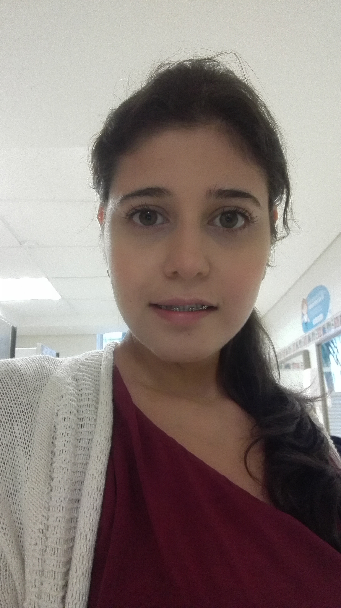
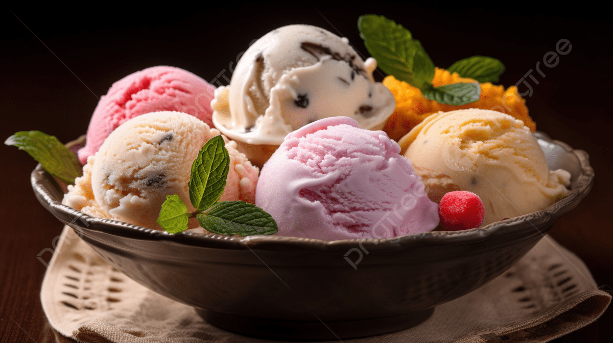

<h1>Kenny Morales</h1>

Animador y Modelador Digital</H1>

<h1>Samuel Restrepo Díaz</h1>

Soy estudiante de ingenieria multimedia y me gusta mucho la parte de animación y video juegos. soy apasionada por el conocimiento, me gusta la musica, la lluvia y los gatos.</H1>

Ubicación: Cali</H1>

Plato Favorito: El helado</H1>

Rol: Diseñador de Contenidos Digitales

Ubicación: Caicedonia Valle</H1>

Soy estudiante de Ingeniería Multimedia en la Universidad Nacional Abierta y a Distancia (UNAD), me interesa el desarrollo de videojuegos y la creación de experiencias interactivas, tengo especial interés en la edición de audio y video, la fotografía y el marketing digital, cuento con conocimientos básicos en programación y diseño digital, y me gusta estructurar 
proyectos creativos combinando tecnología y estrategia</H1>

Comida favorita:Salchipapa (revisar carpeta)

##  Integrante: Andres Henao

**Nombre:** Andres Henao
**Rol en la industria:** especialista en marketing y comunidad  
**Ubicación:** Guacari, Valle del  Cauca, Colombia 
**Perfil:** Estudiante de último semestre, apasionado por el marketing digital y el desarrollo web. Me gusta aprender nuevas cosas y aportar conocimiento, ideas y soluciones.

### Mi comida Favorita

